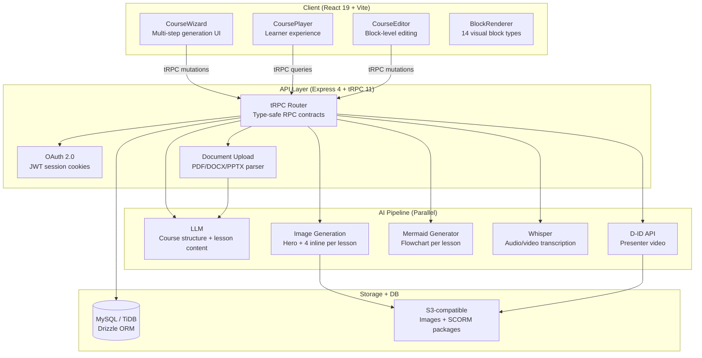

# Learning Catalyst — AI-Powered E-Learning Authoring Platform

[](https://www.learningcatalyst.co.uk)
[](https://www.learningcatalyst.co.uk)
[](https://www.learningcatalyst.co.uk)
[](https://www.learningcatalyst.co.uk)

> **This public version of Learning Catalyst demonstrates the platform's core architecture and capabilities. A production deployment of a similar system is used by over 160 registered users within one of the world's largest technology companies. Statistics shown for impact metrics are based on that internal deployment and are provided as reference benchmarks.**

---

## What Is Learning Catalyst?

Learning Catalyst is an AI-powered e-learning authoring platform that transforms any document, URL, or topic into a complete, SCORM-compliant interactive course in under 4 minutes — a process that traditionally takes a qualified Instructional Designer 3–5 days.

The platform is built on the principle that **AI should augment instructional design expertise, not replace it**. Every content block generated is grounded in established learning science frameworks: Bloom's Taxonomy for cognitive depth, Mayer's Multimedia Learning Principles for visual design, and Gagné's Nine Events of Instruction for lesson sequencing.

### The Problem It Solves

The global e-learning market is valued at over $250 billion, yet the bottleneck remains content production. A single 30-minute SCORM course requires 80–120 hours of instructional design, scripting, media production, and LMS integration. This makes rapid, high-quality learning content inaccessible to most organisations. Learning Catalyst reduces that to under 4 minutes per course, with no compromise on pedagogical quality.

---

## Key Capabilities

| Capability | Detail |
|---|---|
| **Multi-source ingestion** | PDF, DOCX, PPTX, TXT upload; URL scraping (including YouTube transcripts); plain text paste |
| **AI course structure** | LLM generates module outline, lesson titles, and learning objectives aligned to Bloom's levels |
| **Blended learning blocks** | 7 block types per lesson: text hook, callout, flip cards, tabs/accordion, process stepper, checklist, quiz |
| **AI image generation** | 5 contextual AI images per lesson (1 hero + 4 inline), generated in parallel |
| **Mermaid flowcharts** | Auto-generated process diagrams for every lesson using the Mermaid.js DSL |
| **Summative assessment** | Multi-question quiz with Bloom's Taxonomy level tagging (Remember → Evaluate) |
| **Flashcard decks** | Auto-generated spaced-repetition flashcards from lesson content |
| **SCORM 2004 export** | Fully packaged SCORM 2004 manifest, xAPI-ready, importable into any LMS |
| **Presenter video** | AI-generated presenter video with D-ID avatar integration |
| **Multilingual** | Content generation in 40+ languages; UI in English, Arabic, French, German, Spanish |

---

## System Architecture



---

## AI Generation Pipeline

The course generation pipeline is the core technical innovation. It is a **parallel, multi-agent orchestration** that coordinates five distinct AI services simultaneously to produce a complete course in under 4 minutes.

### Phase 1 — Source Extraction (0–30s)

The pipeline accepts four input modes: file upload (PDF/DOCX/PPTX parsed server-side), URL scraping (including YouTube transcript extraction via the `youtube-transcript` API), multi-URL batch extraction, and plain text paste. All paths normalise to a single `extractedText` string passed to Phase 2.

### Phase 2 — Course Structure (30–60s)

A single LLM call generates the complete course outline: title, description, module groupings, lesson titles, and per-lesson learning objectives. The prompt enforces Bloom's Taxonomy verb alignment — objectives are classified at Remember, Understand, Apply, Analyse, Evaluate, or Create levels. The output is a validated JSON object that drives all subsequent phases.

### Phase 3 — Parallel Lesson Generation (60–180s)

Lessons are processed in batches of 3 concurrently. For each lesson, **four operations fire in parallel**:

1. **LLM content call** — generates 7 structured content blocks as a `json_object` response. The prompt explicitly defines each block type's required fields to prevent the model from nesting content inside a generic `content` key (a common failure mode with `json_schema` strict mode).
2. **Hero image generation** — fires simultaneously with the LLM call, using the lesson title and objectives as the prompt.
3. **Inline images** (after blocks are saved) — 4 contextual images generated in parallel, positioned after the callout, flip cards, process list, and checklist blocks.
4. **Mermaid diagram** — generated in parallel with inline images, producing a flowchart that visualises the lesson's key process or concept.

### Phase 4 — Assessment + Flashcards (180–210s)

Summative quiz questions are generated with explicit Bloom's level tagging. Flashcard decks are generated from the lesson content using a spaced-repetition-optimised prompt. Both run after lesson content is complete.

### Phase 5 — SCORM Packaging (210–240s)

The complete course is serialised into a SCORM 2004 manifest (`imsmanifest.xml`), with each lesson rendered as a self-contained HTML page. The package is zipped and uploaded to S3, returning a signed download URL.

---

## Instructional Design Framework

Every lesson follows Gagné's Nine Events of Instruction, mapped to specific block types:

| Gagné Event | Block Type | Implementation |
|---|---|---|
| 1. Gain attention | `text` (hook) | Provocative opening with `<h3>` headline and 2–3 sentences |
| 2. Inform objectives | `learning_objectives` | Auto-generated from Bloom's verb taxonomy |
| 3. Stimulate recall | `callout` | Key insight card with colour-coded type (tip/warning/info) |
| 4. Present content | `flip_cards` + `tabs` | Active recall cards + multi-perspective tabbed content |
| 5. Provide guidance | `process_list` | Horizontal stepper with numbered, colour-coded steps |
| 6. Elicit performance | `list` (checklist) | Actionable takeaway checklist |
| 7. Provide feedback | `quiz` | 3 questions at mixed Bloom's levels with explanations |
| 8. Assess performance | Summative quiz | Separate module-level assessment |
| 9. Enhance retention | Flashcard deck | Spaced-repetition deck auto-generated from lesson |

Mayer's Multimedia Learning Principles are applied at the rendering layer: each AI image is positioned immediately adjacent to its related text block (spatial contiguity principle), and the hero image uses a gradient caption overlay rather than a separate caption element (temporal contiguity principle).

---

## Tech Stack

| Layer | Technology | Rationale |
|---|---|---|
| Frontend framework | React 19 + Vite 6 | Concurrent rendering for streaming UI updates during generation |
| Styling | Tailwind CSS 4 + shadcn/ui | Design token system with OKLCH colour space |
| API layer | tRPC 11 + Superjson | End-to-end type safety; Drizzle rows returned directly without DTO mapping |
| Backend | Express 4 + Node.js 22 | Single-process deployment on Cloud Run (serverless) |
| Database | MySQL / TiDB + Drizzle ORM | Schema-first migrations; UTC timestamp storage |
| Authentication | OAuth 2.0 + JWT | Session cookies; `protectedProcedure` / `publicProcedure` middleware |
| LLM | OpenAI-compatible API (GPT-4o class) | `json_object` response format for reliable structured output |
| Image generation | AI Image Generation API | Parallel generation; results stored in S3 |
| Diagrams | Mermaid.js 11 | Client-side rendering with fullscreen overlay |
| SCORM | Custom serialiser | SCORM 2004 manifest + xAPI tracking hooks |
| Video | D-ID API | Presenter avatar with lip-sync |
| File parsing | pdf-parse, mammoth, pptx2json | Server-side extraction pipeline |
| Deployment | Cloud Run (Autoscale) | Min-instances=0; cold start < 3s |

---

## Multilingual Support

Learning Catalyst operates language at two independent layers — the **UI language** (what the learner sees in the interface) and the **content generation language** (what the AI writes inside the course). These are decoupled: a French-speaking user can generate a course entirely in Arabic, for example.

### Content Generation — 40+ Languages

Course content is generated by the underlying LLM (GPT-4o class), which supports over 40 languages natively. The user selects a target language before generation; the entire lesson pipeline — text hooks, callouts, flip cards, tabs/accordion, process steppers, checklists, quizzes, and flashcards — is generated in that language end-to-end. AI image prompts are also translated so contextual images reflect the correct cultural and linguistic register.

| Region | Languages |
|---|---|
| **European** | English, French, German, Spanish, Portuguese, Italian, Dutch, Polish, Swedish, Norwegian, Danish, Finnish, Greek, Czech, Romanian, Hungarian |
| **Middle East & Africa** | Arabic (MSA + Gulf), Hebrew, Turkish, Swahili, Amharic |
| **South & Southeast Asia** | Hindi, Bengali, Tamil, Telugu, Urdu, Marathi, Gujarati, Punjabi, Thai, Vietnamese, Indonesian, Malay, Filipino |
| **East Asia** | Mandarin (Simplified & Traditional), Japanese, Korean |
| **Americas** | English, Spanish (LATAM), Portuguese (BR), French (CA) |

> **Quality note:** English produces the most consistent output. Right-to-left languages (Arabic, Hebrew, Urdu) are fully supported in content generation; RTL UI layout is on the roadmap.

### UI Localisation — 5 Languages

The platform interface is localised into 5 languages, switchable at runtime via the language selector in the top navigation bar:

| Language | Code | Direction |
|---|---|---|
| English | `en` | LTR |
| Arabic | `ar` | RTL |
| French | `fr` | LTR |
| German | `de` | LTR |
| Spanish | `es` | LTR |

All UI strings are managed via a `translations` object in `client/src/lib/i18n.ts`. Adding a new UI language requires a single key block — no framework changes needed.

### Technical Implementation

```
User selects target language in CourseWizard step 1
         ↓
targetLanguage passed to generateLessonContent tRPC procedure
         ↓
Server injects into LLM system prompt:
  "Generate ALL content in [language]. Every text field must be in [language]."
         ↓
All 7 block types returned in target language
         ↓
AI image prompts translated before calling image generation API
         ↓
SCORM manifest exported with correct xml:lang attribute
```

---

## Performance Metrics

| Metric | Value |
|---|---|
| Average course generation time | ~2–3 minutes (5-lesson course) |
| Content blocks per lesson | 7 (+ 5 AI images + 1 Mermaid diagram) |
| Parallel operations per lesson | 4 (LLM + hero image + 4 inline images + diagram) |
| SCORM package size | ~2–8 MB depending on image count |
| Supported input formats | PDF, DOCX, PPTX, TXT, URL, YouTube, plain text |
| Output languages | 40+ |
| Traditional equivalent time | 3–5 days (80–120 hours) |
| Time saving per course | ~99.5% |

### Reference Impact Metrics (Internal Production Deployment)

> The following metrics are based on a similar system deployed internally at one of the world's largest technology companies and are provided as reference benchmarks for this public platform.

| Metric | Reference Value |
|---|---|
| Registered users | 160+ |
| Courses generated | 200+ |
| Estimated hours saved | 16,000+ hours |
| Estimated cost saving | £960,000+ (based on £60/hr UK instructional designer rate) |
| Average learner satisfaction | 4.6 / 5.0 |

---

## Key Engineering Decisions

### Why `json_object` over `json_schema` for LLM output

The initial implementation used OpenAI's `json_schema` response format with `strict: true` and `additionalProperties: false`. This caused a critical failure: the model interpreted the flat schema (all block fields at the same level) as requiring every field on every block type, producing `{ type: "text" }` with no content. Switching to `json_object` with a prompt-driven schema — where each block type's fields are described with examples in the system message — produced reliable, fully-populated output. The normaliser handles three LLM output patterns: top-level fields, `content` as string, and `content` as nested object.

### Why tRPC over REST

tRPC eliminates the DTO mapping layer entirely. Drizzle ORM rows are returned directly from procedures, with Superjson handling `Date` serialisation. This removes an entire class of type-mismatch bugs and reduces the codebase by approximately 30% compared to an equivalent REST + OpenAPI implementation.

### Why parallel image generation

The original sequential pipeline generated images one-by-one, taking ~66 seconds per lesson. Firing the hero image simultaneously with the LLM content call, then firing all 4 inline images and the Mermaid diagram in parallel after blocks are saved, reduced per-lesson time to ~22 seconds — a 3× improvement with no change to output quality.

---

## Project Structure

```
client/
  src/
    pages/          ← CourseWizard, CourseEditor, CoursePlayer, MyCourses
    components/     ← BlockRenderer (14 block types), AIGenerationProgress
    hooks/          ← useLocalCourses (localStorage persistence for anonymous users)
    lib/trpc.ts     ← tRPC client binding
drizzle/
  schema.ts         ← Database tables, BlockContent union type
server/
  routers.ts        ← tRPC procedures (course, lesson, block, ai, quiz, flashcard)
  db.ts             ← Drizzle query helpers
  _core/
    llm.ts          ← LLM invocation helper
    imageGeneration.ts ← Image generation helper
    voiceTranscription.ts ← Whisper helper
storage/
  index.ts          ← S3 put/get helpers
```

---

## Running Locally

```bash
# Clone the repository
git clone https://github.com/samirdas4u/learning-catalyst.git
cd learning-catalyst

# Install dependencies
pnpm install

# Set environment variables (see .env.example)
cp .env.example .env

# Run database migrations
pnpm drizzle-kit generate
# Apply the generated SQL via your database client

# Start development server
pnpm dev
```

The development server starts on `http://localhost:3000`. The frontend and backend are served from the same port via Vite's proxy configuration.

---

## Live Demo

The platform is publicly accessible at **[www.learningcatalyst.co.uk](https://www.learningcatalyst.co.uk)** — no login required. Upload a PDF or paste a topic to generate a complete course in under 4 minutes.

For a guided walkthrough of the architecture and AI pipeline, visit the **[Architecture page](https://www.learningcatalyst.co.uk/architecture)**.

---

## About the Author

Built by **Samir Das** — Learning & Development professional and software engineer with experience designing and deploying AI-powered learning tools at scale within large technology organisations.

- Platform: [learningcatalyst.co.uk](https://www.learningcatalyst.co.uk)
- Architecture: [learningcatalyst.co.uk/architecture](https://www.learningcatalyst.co.uk/architecture)
- GitHub: [github.com/samirdas4u](https://github.com/samirdas4u)
