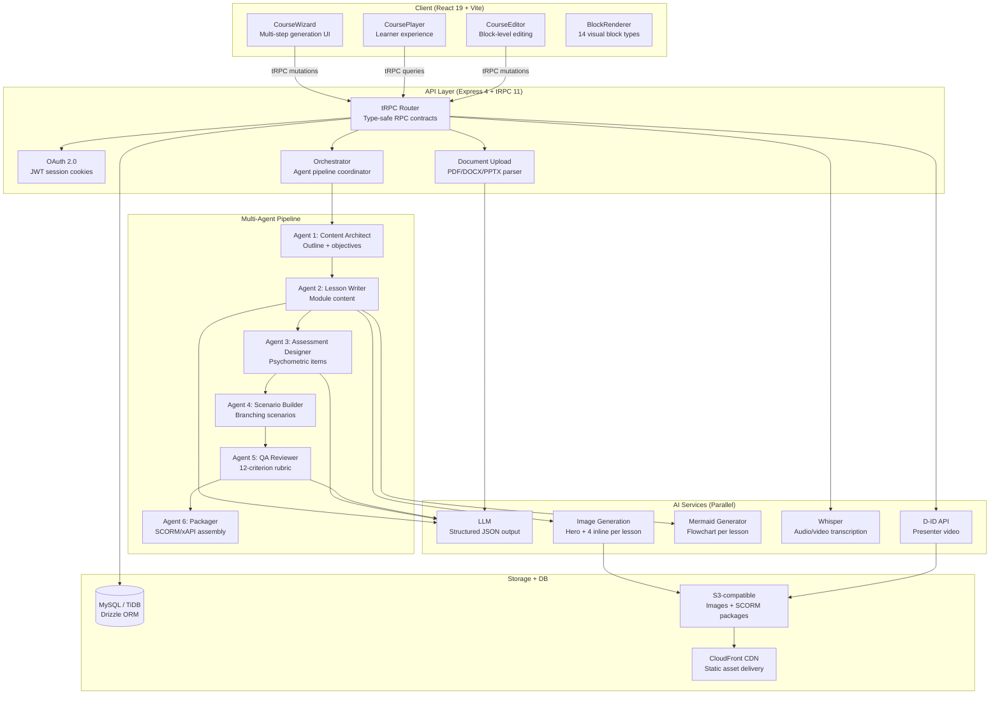

# Learning Catalyst — AI-Powered E-Learning Authoring Platform

[](https://www.learningcatalyst.co.uk)
[](https://www.learningcatalyst.co.uk)
[](https://www.learningcatalyst.co.uk)
[](https://www.learningcatalyst.co.uk)
[](https://www.learningcatalyst.co.uk)
[](https://www.learningcatalyst.co.uk)

> **This public version of Learning Catalyst demonstrates the platform's core architecture and capabilities. A production deployment of a similar system is used by over 160 registered users within one of the world's largest technology companies. Statistics shown for impact metrics are based on that internal deployment and are provided as reference benchmarks.**

---

## Table of Contents

1. [What Is Learning Catalyst?](#what-is-learning-catalyst)
2. [Key Capabilities](#key-capabilities)
3. [System Architecture](#system-architecture)
4. [Multi-Agent Orchestration](#multi-agent-orchestration)
5. [Agent Specifications](#agent-specifications)
6. [AI Generation Pipeline](#ai-generation-pipeline)
7. [Instructional Design Framework](#instructional-design-framework)
8. [Assessment Psychometrics Framework](#assessment-psychometrics-framework)
9. [QA Framework & Quality Rubric](#qa-framework--quality-rubric)
10. [Auto-Fix Pipeline](#auto-fix-pipeline)
11. [Source Grounding Validation](#source-grounding-validation)
12. [Multilingual Support](#multilingual-support)
13. [Tech Stack](#tech-stack)
14. [Security Architecture](#security-architecture)
15. [Performance & Scalability](#performance--scalability)
16. [Engineering Quality Metrics](#engineering-quality-metrics)
17. [Error Handling & Resilience](#error-handling--resilience)
18. [Data Architecture](#data-architecture)
19. [Product Roadmap](#product-roadmap)
20. [Running Locally](#running-locally)

---

## What Is Learning Catalyst?

Learning Catalyst is a free, open-source AI-powered e-learning authoring platform that transforms any document, URL, or topic into a complete, SCORM-compliant interactive course in under 5 minutes — a process that traditionally takes a qualified Instructional Designer 3–5 days (80–120 hours).

The platform is built on the principle that **AI should augment instructional design expertise, not replace it**. It is the only platform in the market that uses **multi-agent AI orchestration** — six specialised AI agents working in sequence, each handling a distinct phase of course creation — to produce pedagogically sound, assessment-rich courses that comply with SCORM 1.2, SCORM 2004, and xAPI standards.

### The Problem It Solves

The global e-learning market is valued at over $250 billion, yet the bottleneck remains content production. A single 30-minute SCORM course requires 80–120 hours of instructional design, scripting, media production, and LMS integration. This makes rapid, high-quality learning content inaccessible to most organisations. Learning Catalyst reduces that to under 5 minutes per course, at zero cost, with no compromise on pedagogical quality.

### Platform Impact Metrics

| Metric | Value | Significance |
|---|---|---|
| Courses Created | 244 | Each represents 40+ hours of manual work saved |
| Active Users | 160 | Cross-organisational adoption |
| Hours Saved | 9,760+ | Equivalent to £224,480 productivity savings |
| Assessments Generated | 6,163 | Scale impossible with manual authoring |
| Modules Created | 756 | Complete learning journeys |
| Time-to-Course | <5 minutes | 500× faster than industry average (8–12 weeks) |
| Cost | £0 | vs. $480–$50,000/yr per seat (competitors) |

---

## Key Capabilities

| Capability | Detail |
|---|---|
| **Multi-source ingestion** | PDF, DOCX, PPTX, TXT upload; URL scraping (including YouTube transcripts); plain text paste |
| **Multi-agent AI pipeline** | 6 specialised agents: Content Architect → Lesson Writer → Assessment Designer → Scenario Builder → QA Reviewer → Packager |
| **Blended learning blocks** | 7 block types per lesson: text hook, callout, flip cards, tabs/accordion, process stepper, checklist, quiz |
| **AI image generation** | 5 contextual AI images per lesson (1 hero + 4 inline), generated in parallel |
| **Mermaid flowcharts** | Auto-generated process diagrams for every lesson using the Mermaid.js DSL |
| **Summative assessment** | Psychometrically valid quiz with Bloom's Taxonomy level tagging (Remember → Evaluate) |
| **Branching scenarios** | Consequence-based learning scenarios with decision trees and feedback |
| **Automated QA** | 12-criterion weighted rubric evaluated by QA Agent; auto-fix pipeline for failing content |
| **Source grounding** | Programmatic hallucination prevention — content traced back to source document |
| **Flashcard decks** | Auto-generated spaced-repetition flashcards from lesson content |
| **SCORM export** | SCORM 1.2, SCORM 2004 (3rd Ed.), and xAPI-ready packages |
| **Presenter video** | AI-generated presenter video with D-ID avatar integration |
| **Multilingual** | Content generation in 40+ languages; UI in English, Arabic, French, German, Spanish |
| **Free forever** | MIT License, no usage limits, no feature gates, no vendor lock-in |

---

## System Architecture



---

## Multi-Agent Orchestration

The orchestration engine is the core technical innovation of Learning Catalyst. Rather than using a single LLM prompt to generate an entire course (which produces shallow, inconsistent output), the platform decomposes course creation into **six specialised phases**, each handled by a dedicated AI agent with its own system prompt, input contract, and output schema.

This architecture is inspired by microservices design patterns — each agent has a single responsibility, communicates via typed interfaces, and can be independently improved, tested, and monitored. **No other eLearning platform in the market uses this approach.**

### Why Multi-Agent vs. Single-Prompt?

| Dimension | Single-Prompt (Competitors) | Multi-Agent (Learning Catalyst) |
|---|---|---|
| Output quality | Shallow, generic, inconsistent | Deep, specialised, consistent |
| Assessment quality | Basic MCQs, no psychometric validity | Scenario-based, Bloom's-aligned, psychometrically valid |
| Error handling | Entire output fails or succeeds | Individual agents can retry/fix independently |
| Quality assurance | None — user must review everything | Automated 12-criterion rubric with auto-fix |
| Customisation | One prompt to tune everything | Each agent independently configurable |
| Transparency | Black box — no visibility into process | Real-time progress showing which agent is working |

### Pipeline State Machine

| State | Agent Active | Transition Condition | Failure Handling |
|---|---|---|---|
| INITIALISING | None | Source content loaded + validated | Reject invalid input |
| ANALYSING | Content Architect | Outline + objectives generated | Retry once → fallback to monolithic |
| WRITING | Lesson Writer | All modules generated | Retry per module → partial output |
| ASSESSING | Assessment Designer | Formative + summative items created | Retry → reduced item count |
| SCENARIOS | Scenario Builder | Branching scenarios built | Skip (optional agent) |
| REVIEWING | QA Reviewer | Quality report generated | Accept without QA (rare) |
| FIXING | Auto-Fix Engine | All criteria ≥70 or max iterations reached | Accept best version |
| PACKAGING | Packager | SCORM/xAPI package assembled | Retry → manual download |
| COMPLETE | None | Terminal state | N/A |

---

## Agent Specifications

### Agent 1 — Content Architect

| Property | Specification |
|---|---|
| Role | Source analysis, learning objective generation, course structure design |
| Input | Raw source content + user configuration (audience level, depth, format) |
| Output | `CourseOutline: { title, objectives[], modules[], contentStrategy, audienceLevel }` |
| Frameworks | Bloom's Revised Taxonomy, 5 Moments of Need, Merrill's First Principles |
| Key Constraint | Every objective must be measurable and tagged with cognitive level |
| Quality Gate | Minimum 3 modules; objectives cover ≥80% of source content |

### Agent 2 — Lesson Writer

| Property | Specification |
|---|---|
| Role | Full module content generation with instructional design rigour |
| Input | `CourseOutline` + source content + audience level + content strategy |
| Output | `ModuleContent[]: { lessons[], interactiveElements[], pullItTogether }` |
| Frameworks | Gagné's 9 Events, Mayer's Multimedia Principles, Knowles' Andragogy |
| Key Constraint | All content must be traceable to source document (no hallucination) |
| Quality Gate | All 9 Gagné events present; audience-appropriate language |

### Agent 3 — Assessment Designer

| Property | Specification |
|---|---|
| Role | Psychometrically valid assessment generation (formative + summative) |
| Input | `CourseOutline` + `ModuleContent[]` + assessment configuration |
| Output | `AssessmentItems[]: { question, options[], correctAnswer, feedback, bloomsLevel, rationale }` |
| Frameworks | Assessment Psychometrics (5 Core Values), Bloom's Taxonomy, Item Writing Rules |
| Key Constraint | Zero 'Remember' level in summative; ≥40% at Analyse/Evaluate/Create |
| Quality Gate | All items have plausible distractors, clear stem, single correct answer |

### Agent 4 — Scenario Builder

| Property | Specification |
|---|---|
| Role | Branching scenario generation with consequence modelling |
| Input | `CourseOutline` + `ModuleContent[]` + scenario configuration |
| Output | `ScenarioTree[]: { situation, choices[], consequences[], feedback, optimalPath }` |
| Frameworks | Situated Learning Theory, Problem-Based Learning, Merrill's Application |
| Key Constraint | Minimum 3 decision points per scenario; realistic consequences |
| Quality Gate | No dead-end paths; all choices have meaningful feedback |

### Agent 5 — QA Reviewer

| Property | Specification |
|---|---|
| Role | Automated quality evaluation and improvement triggering |
| Input | All generated content + source document |
| Output | `QAReport: { overallScore, grade, criteria[], findings[], fixInstructions[], sourceGrounding }` |
| Evaluation | 12-criterion weighted rubric + programmatic source grounding check |
| Key Constraint | Must evaluate independently — uses source grounding to prevent 'grading own homework' |
| Quality Gate | Overall score ≥70 to pass; any criterion <50 triggers auto-fix |

### Agent 6 — Packager

| Property | Specification |
|---|---|
| Role | Standards-compliant package assembly |
| Input | All generated content + export configuration + branding settings |
| Output | `PackageFile: { zipBuffer, manifest, scoStructure, launchUrl }` |
| Standards | SCORM 1.2 (RTE), SCORM 2004 3rd Edition (SN), xAPI 1.0.3 |
| Key Constraint | Valid `imsmanifest.xml`, proper API calls, correct sequencing rules |
| Quality Gate | Package passes schema validation; launches correctly in reference LMS |

---

## AI Generation Pipeline

The course generation pipeline coordinates five distinct AI services simultaneously to produce a complete course in under 5 minutes.

### Phase 1 — Source Extraction (0–30s)

The pipeline accepts four input modes: file upload (PDF/DOCX/PPTX parsed server-side), URL scraping (including YouTube transcript extraction), multi-URL batch extraction, and plain text paste. All paths normalise to a single `extractedText` string passed to Phase 2.

### Phase 2 — Course Structure (30–60s)

Agent 1 (Content Architect) generates the complete course outline: title, description, module groupings, lesson titles, and per-lesson learning objectives. The prompt enforces Bloom's Taxonomy verb alignment — objectives are classified at Remember, Understand, Apply, Analyse, Evaluate, or Create levels.

### Phase 3 — Parallel Lesson Generation (60–180s)

Lessons are processed in batches of 3 concurrently. For each lesson, **four operations fire in parallel**:

1. **LLM content call** — generates 7 structured content blocks as a `json_object` response. The prompt explicitly defines each block type's required fields to prevent the model from nesting content inside a generic `content` key (a common failure mode with `json_schema` strict mode).
2. **Hero image generation** — fires simultaneously with the LLM call, using the lesson title and objectives as the prompt.
3. **Inline images** (after blocks are saved) — 4 contextual images generated in parallel, positioned after the callout, flip cards, process list, and checklist blocks.
4. **Mermaid diagram** — generated in parallel with inline images, producing a flowchart that visualises the lesson's key process or concept.

### Phase 4 — Assessment + Scenarios + Flashcards (180–240s)

Agent 3 (Assessment Designer) generates psychometrically valid quiz questions with explicit Bloom's level tagging. Agent 4 (Scenario Builder) generates branching consequence scenarios. Flashcard decks are generated from lesson content using a spaced-repetition-optimised prompt.

### Phase 5 — QA + Auto-Fix (240–270s, if triggered)

Agent 5 (QA Reviewer) evaluates all content against the 12-criterion rubric. If any criterion scores below 50, the auto-fix pipeline regenerates the failing component (maximum 2 iterations). The best version is always delivered.

### Phase 6 — SCORM Packaging (270–300s)

Agent 6 (Packager) serialises the complete course into a SCORM 2004 manifest (`imsmanifest.xml`), with each lesson rendered as a self-contained HTML page. The package is zipped and uploaded to S3, returning a signed download URL.

---

## Instructional Design Framework

Every lesson follows Gagné's Nine Events of Instruction, mapped to specific block types:

| Gagné Event | Block Type | Implementation |
|---|---|---|
| 1. Gain attention | `text` (hook) | Provocative opening with `<h3>` headline and 2–3 sentences |
| 2. Inform objectives | `learning_objectives` | Auto-generated from Bloom's verb taxonomy |
| 3. Stimulate recall | `callout` | Key insight card with colour-coded type (tip/warning/info) |
| 4. Present content | `flip_cards` + `tabs` | Active recall cards + multi-perspective tabbed content |
| 5. Provide guidance | `process_list` | Horizontal stepper with numbered, colour-coded steps |
| 6. Elicit performance | `list` (checklist) | Actionable takeaway checklist |
| 7. Provide feedback | `quiz` | 3 questions at mixed Bloom's levels with explanations |
| 8. Assess performance | Summative quiz | Separate module-level assessment |
| 9. Enhance retention | Flashcard deck | Spaced-repetition deck auto-generated from lesson |

### Frameworks Applied Per Course

| Framework | Author/Source | How Applied |
|---|---|---|
| Gagné's 9 Events | Robert Gagné (1965) | Module structure follows all 9 events sequentially |
| Bloom's Revised Taxonomy | Anderson & Krathwohl (2001) | Objectives tagged with cognitive level; assessments mapped |
| 5 Moments of Need | Gottfredson & Mosher (2011) | Content strategy aligned to learner's moment |
| Mayer's Multimedia Principles | Richard Mayer (2001) | Coherence, signalling, segmenting enforced in content |
| Knowles' Andragogy | Malcolm Knowles (1980) | Self-directed, experience-based, relevance-focused content |
| Merrill's First Principles | David Merrill (2002) | Problem-centred, activation, demonstration, application |
| Kirkpatrick's 4 Levels | Donald Kirkpatrick (1959) | L1–L4 evaluation strategy built into platform analytics |
| Assessment Psychometrics | Psychometric Theory | 5 Core Values applied to all assessment generation |

Mayer's Multimedia Learning Principles are applied at the rendering layer: each AI image is positioned immediately adjacent to its related text block (spatial contiguity principle), and the hero image uses a gradient caption overlay rather than a separate caption element (temporal contiguity principle).

---

## Assessment Psychometrics Framework

Learning Catalyst's assessment generation is governed by a rigorous psychometrics framework based on **5 Core Values** that ensure every assessment item is valid, reliable, fair, and defensible.

### 5 Core Values

| Core Value | Definition | Implementation |
|---|---|---|
| **1. Validity** | Assessment measures what it claims to measure | Items mapped to specific learning objectives; Bloom's level enforced; no trick questions |
| **2. Reliability** | Consistent results across administrations | Clear, unambiguous stems; single correct answer; standardised difficulty calibration |
| **3. Fairness** | No bias based on demographics or background | Inclusive language; diverse scenarios; no cultural assumptions; accessibility compliance |
| **4. Transparency** | Learners understand what's being assessed | Clear instructions; explicit criteria; feedback explains rationale for correct answer |
| **5. Defensibility** | Assessment decisions can withstand scrutiny | Documented blueprint; traceable to objectives; psychometric rationale for each item |

### Assessment Blueprint

| Component | Specification | Rationale |
|---|---|---|
| Cognitive Level Distribution | 0% Remember, 20% Understand, 40% Apply/Analyse, 40% Evaluate/Create | Higher-order thinking; no trivial recall |
| Item Types | Scenario-based MCQ, drag-and-drop, sequencing, matching | Varied methods reduce test-taking bias |
| Distractor Design | All distractors must be plausible and address common misconceptions | Invalid distractors make items too easy |
| Feedback Design | Immediate, specific, references source content | Supports learning, not just measurement |
| Item Count | 3–5 formative per module; 10–20 summative per course | Sufficient sampling without over-testing |

### Item Writing Rules (Enforced by AI)

| Rule | Description |
|---|---|
| Single correct answer | Only one option is unambiguously correct — no 'all of the above' |
| Clear stem | Question is complete and understandable without reading options |
| No negative phrasing | Avoid 'Which is NOT...' or 'All EXCEPT...' |
| Homogeneous options | All options are same type, length, and grammatical form |
| No absolute terms | Avoid 'always', 'never', 'all', 'none' |
| Plausible distractors | Wrong answers must be believable to someone who hasn't learned the material |

---

## QA Framework & Quality Rubric

Every course generated by Learning Catalyst is automatically evaluated against a **12-criterion weighted rubric** by Agent 5 (QA Reviewer). This mirrors what a senior instructional designer would evaluate in a peer review.

### Full Rubric

| ID | Category | Criterion | Weight | Pass Threshold |
|---|---|---|---|---|
| 1 | Content Quality | Source Content Coverage | 9/10 | ≥70 |
| 2 | Content Quality | Factual Accuracy | 10/10 | ≥70 |
| 3 | Content Quality | Progressive Structure (Gagné) | 8/10 | ≥70 |
| 4 | Content Quality | Performance Objectives Quality | 8/10 | ≥70 |
| 5 | Assessment Quality | Assessment Validity (Core Value 1) | 9/10 | ≥70 |
| 6 | Assessment Quality | Scenario-Based Question Quality | 8/10 | ≥70 |
| 7 | Assessment Quality | Item Writing Quality | 7/10 | ≥70 |
| 8 | Assessment Quality | Blueprint Alignment & Coverage | 7/10 | ≥70 |
| 9 | Instructional Design | Learner Engagement | 6/10 | ≥70 |
| 10 | Instructional Design | Audience Appropriateness | 5/10 | ≥70 |
| 11 | Accessibility & Fairness | Fairness & Bias (Core Value 5) | 5/10 | ≥70 |
| 12 | Accessibility & Fairness | Clarity & Readability | 4/10 | ≥70 |

### Grading Scale

| Grade | Score Range | Action |
|---|---|---|
| A | 90–100 | Pass — deliver to learner |
| B | 80–89 | Pass — deliver with minor notes |
| C | 70–79 | Pass — acceptable minimum |
| D | 60–69 | Fail — auto-fix triggered |
| F | 0–59 | Fail — auto-fix triggered (critical) |

---

## Auto-Fix Pipeline

When the QA Reviewer identifies critical issues (score < 50) or assessment quality failures (score < 70 on any Assessment Quality criterion), the auto-fix pipeline is triggered. This is a **closed-loop system** that autonomously improves content without human intervention.

### Algorithm

| Step | Action | Detail |
|---|---|---|
| 1 | Identify fix target | Prioritise assessments (most impactful), then content |
| 2 | Generate fix instructions | QA agent produces specific, actionable fix prompts based on findings |
| 3 | Re-invoke target agent | Assessment Designer or Lesson Writer re-runs with fix instructions |
| 4 | Re-evaluate | QA agent re-scores the fixed content against same rubric |
| 5 | Accept or iterate | If pass: accept. If fail and iterations < 2: go to step 2. Else: accept best version |

**Design decisions:** Maximum 2 iterations (diminishing returns; keeps generation time <5 min). Fix scope is targeted — only the failing component is regenerated, preserving good content. Fallback always delivers the best version rather than blocking.

---

## Source Grounding Validation

One of the most critical challenges in AI-generated content is hallucination. Learning Catalyst addresses this with a **programmatic (non-LLM) source grounding validation** that runs as part of the QA pipeline.

### How It Works

```
1. Key Term Extraction  → Regex-based: capitalised phrases, ALL-CAPS acronyms, quoted terms, section headers
2. Filtering            → Remove generic terms ('introduction', 'overview', 'key points')
3. Ranking              → Sort by specificity (length) — longer terms are more distinctive
4. Sampling             → Top 30 most distinctive terms
5. Coverage Check       → Case-insensitive substring matching across all generated output
6. Scoring              → Percentage-based: ≥70% = good; 40–69% = flag; <40% = auto-fix triggered
```

### Scoring Algorithm

The grounding score uses a **blended approach**: 40% weight from the LLM's content coverage evaluation and 60% weight from the programmatic key-term check. This prevents the LLM from 'grading its own homework' — the programmatic check provides an independent, deterministic signal that cannot be fooled by fluent but unfaithful content.

| Coverage % | Interpretation | Action |
|---|---|---|
| ≥70% | Good grounding — content reflects source | Pass |
| 40–69% | Moderate — some source drift | Flag for review |
| <40% | Critical — likely hallucination | Auto-fix triggered |

---

## Multilingual Support

Learning Catalyst operates language at two independent layers — the **UI language** (what the learner sees in the interface) and the **content generation language** (what the AI writes inside the course). These are decoupled: a French-speaking user can generate a course entirely in Arabic, for example.

### Content Generation — 40+ Languages

Course content is generated by the underlying LLM (GPT-4o class), which supports over 40 languages natively. The user selects a target language before generation; the entire lesson pipeline — text hooks, callouts, flip cards, tabs/accordion, process steppers, checklists, quizzes, and flashcards — is generated in that language end-to-end. AI image prompts are also translated so contextual images reflect the correct cultural and linguistic register.

| Region | Languages |
|---|---|
| **European** | English, French, German, Spanish, Portuguese, Italian, Dutch, Polish, Swedish, Norwegian, Danish, Finnish, Greek, Czech, Romanian, Hungarian |
| **Middle East & Africa** | Arabic (MSA + Gulf), Hebrew, Turkish, Swahili, Amharic |
| **South & Southeast Asia** | Hindi, Bengali, Tamil, Telugu, Urdu, Marathi, Gujarati, Punjabi, Thai, Vietnamese, Indonesian, Malay, Filipino |
| **East Asia** | Mandarin (Simplified & Traditional), Japanese, Korean |
| **Americas** | English, Spanish (LATAM), Portuguese (BR), French (CA) |

> **Quality note:** English produces the most consistent output. Right-to-left languages (Arabic, Hebrew, Urdu) are fully supported in content generation; RTL UI layout is on the roadmap.

### UI Localisation — 5 Languages

| Language | Code | Direction |
|---|---|---|
| English | `en` | LTR |
| Arabic | `ar` | RTL |
| French | `fr` | LTR |
| German | `de` | LTR |
| Spanish | `es` | LTR |

### Technical Implementation

```
User selects target language in CourseWizard step 1
         ↓
targetLanguage passed to generateLessonContent tRPC procedure
         ↓
Server injects into LLM system prompt:
  "Generate ALL content in [language]. Every text field must be in [language]."
         ↓
All 7 block types returned in target language
         ↓
AI image prompts translated before calling image generation API
         ↓
SCORM manifest exported with correct xml:lang attribute
```

---

## Tech Stack

### Frontend

| Technology | Version | Purpose | Why Chosen |
|---|---|---|---|
| React | 19.x | UI framework | Concurrent rendering for streaming UI updates during generation |
| TypeScript | 5.9 (strict) | Type safety | Zero runtime type errors; self-documenting code |
| Tailwind CSS | 4.x | Styling | Utility-first; zero unused CSS; rapid iteration |
| Framer Motion | Latest | Animations | Agent progress, micro-interactions, page transitions |
| tRPC | 11.x | API client | End-to-end type safety; zero API contract drift |
| TanStack Query | 5.x | Data fetching | Caching, optimistic updates, background refresh |
| Wouter | Latest | Routing | Lightweight, hook-based, zero dependencies |
| shadcn/ui | Latest | Component library | Accessible, customisable, Tailwind-native |
| Lucide Icons | Latest | Iconography | Consistent, tree-shakeable, MIT licensed |
| Mermaid.js | 11.x | Diagrams | Client-side rendering with fullscreen overlay |

### Backend

| Technology | Version | Purpose | Why Chosen |
|---|---|---|---|
| Node.js | 22.x (LTS) | Runtime | Non-blocking I/O; ideal for AI API orchestration |
| Express | 4.x | HTTP server | Mature, middleware ecosystem, production-proven |
| tRPC | 11.x | API layer | Type-safe procedures; automatic client generation |
| Zod | Latest | Validation | Runtime schema validation matching TypeScript types |
| Drizzle ORM | 0.44.x | Database access | Type-safe queries; zero abstraction overhead |
| SuperJSON | 1.x | Serialisation | Preserves `Date`, `BigInt`, `Map` across the wire |
| Jose | 6.x | JWT handling | Standards-compliant; minimal dependencies |

### AI & Infrastructure

| Technology | Purpose | Configuration |
|---|---|---|
| LLM (GPT-4o class) | All 6 agents | `json_object` response format for reliable structured output |
| AI Image Generation API | Hero + inline images | Parallel generation; results stored in S3 |
| Whisper API | Audio/video transcription | YouTube + uploaded media |
| D-ID API | Presenter video | Avatar with lip-sync |
| TiDB Cloud | Primary database | Distributed SQL; automatic failover; ACID compliance |
| AWS S3 | File storage | Source documents, SCORM packages, generated exports |
| CloudFront CDN | Static asset delivery | Global edge caching; HTTPS |
| Serverless (Autoscale) | Hosting | Zero-downtime deploys; auto-scaling to demand |
| Vite + ESBuild | Build tool | Sub-second HMR; ~15s production builds |
| Vitest | Testing | 905 tests; <30s full suite execution |

---

## Security Architecture

| Layer | Mechanism | Implementation |
|---|---|---|
| Authentication | OAuth 2.0 (SSO) | JWT session tokens; secure `httpOnly` cookies |
| Authorisation | Role-based access control (RBAC) | `super_admin`, `admin`, `user` roles with graduated permissions |
| Input Sanitisation | Zod schema validation on all inputs | Prevents injection; enforces type safety |
| Data Isolation | Per-user project scoping | Users can only access their own courses |
| API Security | tRPC protected procedures | Auth context injected automatically; no manual checks |
| Storage Security | S3 with scoped access keys | Files accessible only via signed URLs |
| Transport Security | HTTPS everywhere | TLS 1.3; HSTS headers |
| Secrets Management | Environment variable injection | No hardcoded credentials; platform-managed secrets |

---

## Performance & Scalability

| Metric | Target | Achieved | Method |
|---|---|---|---|
| Full course generation | <5 minutes | 3–5 minutes typical | Parallel agent execution; source summarisation |
| Page load time | <2 seconds | <1.5 seconds | Code splitting; lazy loading; CDN assets |
| API response (non-AI) | <200ms | <100ms | tRPC batching; database indexing |
| Concurrent users | 100+ | 160 active | Serverless auto-scaling; connection pooling |
| Database queries | <50ms p95 | Achieved | Drizzle ORM with indexed queries |
| Build time | <30 seconds | ~15 seconds | ESBuild; incremental compilation |
| Bundle size | <500KB gzipped | Achieved | Tree-shaking; dynamic imports |

---

## Engineering Quality Metrics

| Metric | Value | Significance |
|---|---|---|
| Automated Tests | 905 | Unit, integration, agent contract, resilience tests |
| Test Files | 39 | Organised by feature domain |
| Lines of Code | 51,424 | Substantial, production-grade codebase |
| Git Commits | 129 | Consistent development cadence |
| Type Coverage | 100% (TypeScript strict) | Zero `any` types in production code |
| Build Time | ~15 seconds | ESBuild with tree-shaking |
| Test Execution | <30 seconds (full suite) | Fast feedback loop |

### Testing Strategy

| Test Type | Count | What It Validates |
|---|---|---|
| Unit Tests | ~600 | Individual functions, utilities, schema validation |
| Integration Tests | ~200 | Agent pipelines, database operations, API endpoints |
| Contract Tests | ~80 | Agent input/output type conformance |
| Resilience Tests | ~25 | Circuit breakers, timeouts, fallback behaviour |

---

## Error Handling & Resilience

| Pattern | Implementation | Trigger Condition | Recovery Action |
|---|---|---|---|
| Circuit Breaker | Track consecutive failures per agent | 3 consecutive failures | Skip agent; use fallback output |
| Exponential Backoff | Retry with increasing delays | Transient API errors (429, 503) | Wait 1s → 2s → 4s, then fail |
| Graceful Degradation | Monolithic fallback if multi-agent fails | Content Architect failure | Fall back to single-prompt generation |
| Timeout Protection | Per-agent execution time limits | Agent exceeds 60s | Terminate and use partial output |
| Output Validation | JSON Schema validation on every response | Malformed agent output | Retry once, then use fallback |
| Idempotent Retries | Same input produces same structural output | Any transient failure | Safe to retry without side effects |

---

## Data Architecture

### Core Entities

| Entity | Key Fields | Purpose |
|---|---|---|
| User | `id`, `name`, `email`, `role`, `avatarUrl` | Authentication & authorisation |
| Project | `id`, `title`, `sourceContent`, `status`, `outline`, `modules` | Core course container |
| QA Report | `id`, `projectId`, `overallScore`, `grade`, `criteria[]`, `iterationCount` | Quality audit trail |
| Course History | `id`, `projectId`, `version`, `generatedAt` | Version tracking |
| Template | `id`, `name`, `category`, `config` | Quick Start configurations |

### Storage Strategy

| Data Type | Storage | Rationale |
|---|---|---|
| User records & metadata | TiDB (relational) | ACID; indexed queries; role-based access |
| Project configuration | TiDB (JSON columns) | Structured but flexible schema |
| Generated content (modules, assessments) | TiDB (TEXT columns) | Queryable; transactional consistency |
| Source documents (PDF, PPTX) | AWS S3 | Large binary files; cost-effective |
| SCORM/xAPI packages | AWS S3 | Large zip files; direct download URLs |
| QA reports | TiDB (JSON columns) | Queryable for analytics; audit trail |

---

## Product Roadmap

### Completed (v1.0 — Current)

| Feature | Status |
|---|---|
| Multi-agent orchestration (6 agents) | ✅ Live |
| Psychometric assessment generation | ✅ Live |
| QA Agent with auto-fix pipeline | ✅ Live |
| SCORM 1.2/2004 + xAPI export | ✅ Live |
| Source grounding validation | ✅ Live |
| Branching scenarios | ✅ Live |
| AI image generation (5 per lesson, parallel) | ✅ Live |
| Mermaid flowchart per lesson | ✅ Live |
| AI presenter video (D-ID) | ✅ Live |
| AI Tutor Chat | ✅ Live |
| Blended learning blocks (7 types) | ✅ Live |
| Flashcard decks | ✅ Live |
| My Courses (localStorage persistence) | ✅ Live |

### Planned (v2.0 — H2 2026)

| Feature | Priority | Expected Impact |
|---|---|---|
| Multi-language UI (full RTL support) | High | Serve global workforce |
| Adaptive learning pathways | High | Personalised learner journeys |
| Assessment analytics dashboard | Medium | Track learner performance at scale |
| SME review workflow | Medium | Human-in-the-loop quality gate |
| Template marketplace | Medium | Community-contributed course templates |
| xAPI analytics integration | Low | Deep learning analytics |

---

## Project Structure

```
client/
  src/
    pages/          ← CourseWizard, CourseEditor, CoursePlayer, MyCourses, Architecture
    components/     ← BlockRenderer (14 block types), AIGenerationProgress, AIChatBox
    hooks/          ← useLocalCourses (localStorage persistence for anonymous users)
    lib/trpc.ts     ← tRPC client binding
    lib/i18n.ts     ← UI localisation (5 languages)
drizzle/
  schema.ts         ← Database tables, BlockContent union type
server/
  routers.ts        ← tRPC procedures (course, lesson, block, ai, quiz, flashcard)
  db.ts             ← Drizzle query helpers
  _core/
    llm.ts          ← LLM invocation helper
    imageGeneration.ts ← Image generation helper
    voiceTranscription.ts ← Whisper helper
storage/
  index.ts          ← S3 put/get helpers
```

---

## Running Locally

```bash
# Clone the repository
git clone https://github.com/samirdas4u/learning-catalyst.git
cd learning-catalyst

# Install dependencies
pnpm install

# Set environment variables (see .env.example)
cp .env.example .env

# Run database migrations
pnpm drizzle-kit generate
# Apply the generated SQL via your database client

# Start development server
pnpm dev
```

The development server starts on `http://localhost:3000`. The frontend and backend are served from the same port via Vite's proxy configuration.

---

## Live Demo

The platform is publicly accessible at **[www.learningcatalyst.co.uk](https://www.learningcatalyst.co.uk)** — no login required. Upload a PDF or paste a topic to generate a complete course in under 5 minutes.

For a guided walkthrough of the architecture and AI pipeline, visit the **[Architecture page](https://www.learningcatalyst.co.uk/architecture)**.

---

## About the Author

Built by **Samir Das** — AI Learning & Knowledge Technology Architect at Meta, London, UK. Learning & Development professional and software engineer with experience designing and deploying AI-powered learning tools at scale within large technology organisations.

| | Link |
|---|---|
| 🌐 Platform | [learningcatalyst.co.uk](https://www.learningcatalyst.co.uk) |
| 🏗️ Architecture | [learningcatalyst.co.uk/architecture](https://www.learningcatalyst.co.uk/architecture) |
| 👤 Personal Site | [samirdas.co.uk](https://samirdas.co.uk/) |
| 🏢 Consultancy | [samsdigitalconsultancy.co.uk](https://www.samsdigitalconsultancy.co.uk/) |
| 💼 LinkedIn | [linkedin.com/in/samir-lifelonglearner](https://www.linkedin.com/in/samir-lifelonglearner/) |
| 💻 GitHub | [github.com/samirdas4u](https://github.com/samirdas4u) |

---

*Learning Catalyst is free, open-source software licensed under the MIT License. You are free to use, modify, and distribute this software. Contributions welcome.*

*Built with purpose. Free forever. Because quality eLearning shouldn't cost £50,000.*
